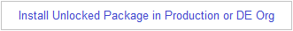
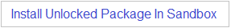
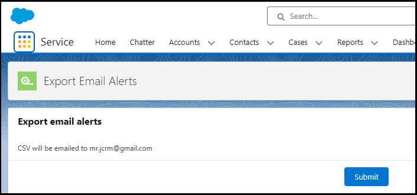

# Export Email Alerts for Salesforce
*To report bugs or request enhancements, use the GitHub [Issues tab](https://github.com/mrjcrm/Export-Email-Alerts/issues) above*
## Features
- Exports to CSV the email addresses for all email alerts and active flow email actions
- CSV is emailed to you
- Resolves multi-user targets (role/subordinates, and groups) into individual email addresses
## Architecture
- Uses Tooling API to read WorkflowAlerts and Flows
- Uses Batch Apex in case your org has a large number of alerts
## Support
exportsfdcalerts@gmail.com
## Install v1.2 Beta 2
 
 
## How to run
1. In the SFDC App Launcher search for 'export' 
   
2. Click 'Submit' 
 
## Sample CSV

## Use cases
- ["I need to find which email alerts use a specific user"](https://success.salesforce.com/answers?id=90630000000gqM7AAI)
- ["I need to query recipients of email alerts"](https://ideas.salesforce.com/s/idea/a0B8W00000GdhyhUAB/allow-tooling-api-to-query-recipients-for-workflow-alerts)
- ["I need to extract all email alert configured or created for different workflow rules"](https://www.sfdcstuff.com/2020/01/fetch-all-workflow-email-alert-details.html#google_vignette)
- ["I need to send a list of all the email alerts a user is registered to"](https://salesforce.stackexchange.com/questions/302616/how-to-query-the-workflowalert-metadata-object)
- ["We have tons of workflows which makes sifting through all of them to find one user a difficult and painful task"](https://ideas.salesforce.com/s/idea/a0B8W00000GdivMUAR/deactivating-users-who-are-used-in-workflows)
