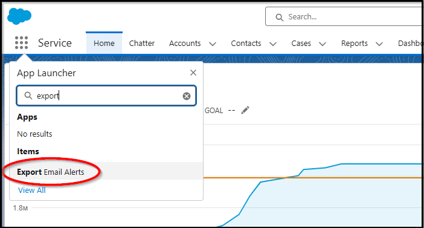

# Export Email Alerts  
## Genesis
Over the years I've heard people asking how can I get a list of all the email addresses used by my org's email alerts.  [How to do abc?](https://shit.com), [How to do def?](https://shit.com) Some of the solutions are interesting.  My solution lists email addresseses for alerts. It looks at alerts for all sObjects in your org. It resolves group targets (like role and groups) into individual email addresses.  Flow Email Actions are included. 
  *Use the GitHub [Issues tab](https://github.com/50471736/Export_Email_Alerts/issues) to report bugs or request enhancements.*
## Architecture
- Uses Tooling API to read WorkflowAlert and Flow sObjects
- Uses Batch Apex, useful if your org has a large number of alerts
## Author
Rod MacKenzie mr.jcrm@gmail.com
## Installation
 
 
## How to run
1. In the SFDC App Launcher search for 'export' 
   
2. Click 'Submit' 
 
## Known issues
- After clicking an alert URL in the CSV, the detail page is shown in SFDC Classic, not Lightning.
## Sample CSV

## Real-World Use Cases
- [Need to find which email alerts use a specific user](https://success.salesforce.com/answers?id=90630000000gqM7AAI)
- [Need to query recipients of email alerts](https://ideas.salesforce.com/s/idea/a0B8W00000GdhyhUAB/allow-tooling-api-to-query-recipients-for-workflow-alerts)
- [Need to extract all email alert configured or created for different workflow rules](https://www.sfdcstuff.com/2020/01/fetch-all-workflow-email-alert-details.html#google_vignette)
- [I need to send a list of all the email alerts a user is registered to](https://salesforce.stackexchange.com/questions/302616/how-to-query-the-workflowalert-metadata-object)
- [UseCase7 NEED TO REVIEW USE CASE](https://trailhead.salesforce.com/trailblazer-community/feed/0D54S00000A7kiySAB)
- [We have tons of workflows which makes sifting through all of them to find one user a difficult and painful task](https://ideas.salesforce.com/s/idea/a0B8W00000GdivMUAR/deactivating-users-who-are-used-in-workflows)